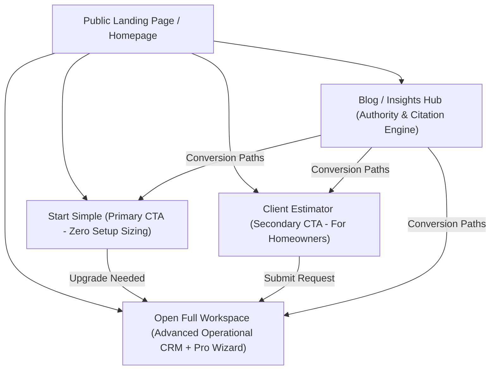

# SolarPro Product Architecture & Progressive Disclosure Blueprint

This document defines the architectural restructuring of **SolarPro** to transition from a single-entry web wizard into a highly converting, three-layered progressive experience. 

The goal is to present a highly polished **public website** first, provide a zero-friction **Start Simple** lane for overwhelmed users, and keep the **full installer web app** as a deeper, optional operational suite.

---

## 1. Executive Recommendation

To maximize lead conversion, build instant credibility with Nigerian property owners, and prevent installer overwhelm, SolarPro must pivot from "SaaS-First" to **"Value-First"**. 

Instead of landing visitors directly inside a multi-step pricing configuration wizard, the system must deploy **progressive disclosure**:



### Strategic Core Decisions:
* **The Default Entry is Public:** The homepage (`/`) becomes a high-converting business showcase, introducing value before software.
* **"Start Simple" is the Hero:** Impatient users get a 1-page sizing shortcut with zero profile setups.
* **Frictionless Homeowner Lane:** Homeowners get an instant, jargon-free ROI estimate that pipes directly into the installer's pipeline.
* **Pro Workspace is Pull-Not-Push:** Advanced features (CRM, custom pricing models, component databases) are locked behind an explicit "Installer Workspace" dashboard.
* **Content is the Acquisition Engine:** A high-value blog/insights layer built specifically for Google SEO search intent and AI retrieval engines (GEO/AEO/LLMO) establishes SolarPro as the definitive source for Nigerian solar system mathematics.

---

## 2. Product Architecture

SolarPro will be partitioned into three cleanly separated, inter-operating layers within the Next.js App Router, supported by a dynamic, static-rendered content directory:

| Layer / Route | Target User | Complexity | Core Mechanics |
| :--- | :--- | :--- | :--- |
| **1. Public Website & Blog** <br>`/` and `/blog` | Lagos installers seeking growth; property owners seeking solar sizing/ROI specs. | **Low** <br>(Marketing/Content) | Static marketing pages, location-specific educational pillars, and local pricing tables. |
| **2. Simple Mode** <br>`/estimator` | Imposed-upon installers in a hurry; non-technical users. | **Minimal** <br>(Zero Setup) | Single-screen appliance select → Instant system recommendation & payback period. |
| **3. Pro Workspace** <br>`/proposals` & `/history` | Full-service Nigerian solar companies managing clients and custom pricing. | **High** <br>(Operational Suite) | Multi-tier configuration, Supabase client tracking sync, dynamic BOMs, currency adjustments, and CRM pipeline. |

### Prevention of User Confusion:
1. **Clear Split Screens:** When clicking "Get Started", the user is presented with a clear visual fork: *“I am an Installer”* vs. *“I am a Property Owner”*.
2. **"Go Pro" Indicators:** Simple Mode remains clean, but includes subtle, premium-styled banners (e.g., *“Need a dynamic BOM with custom local pricing? Switch to Pro Workspace”*) to handle upgrades organically.
3. **Product-Adjacent Navigation:** The header remains focused, clear, and lets search engines map the simple sizers directly.

---

## 3. Website Structure with Blog Integration

The homepage (`/`) will behave like a premium, state-of-the-art product showcase and authority portal.

### Page Directory Structure:
```
/ (Homepage with product overview and featured insights)
├── /pricing (Operational tier limits and business value)
├── /estimator (Frictionless Quick Sizer tool)
├── /blog (The central Insights Hub index)
│   ├── /blog/[category] (Pillar pages: Sizing, Economics, Compliance)
│   └── /blog/[slug] (Answer-first deep-dive articles)
└── /workspace (Pro dashboard entry point)
```

### Homepage Blog Integrations ("From the SolarPro Blog"):
To enhance organic SEO footprint and establish immediate industry competence, the home page includes a dedicated **Local Market Intelligence** bento-grid section featuring:
* **Primary Featured Spot:** A massive visual link to the *“Generator vs. Hybrid Solar: 2026 Nigeria Fuel Economics Report”*.
* **Homeowner Lane Guide:** *“How to Calculate Your Lagos Building Solar Load in 3 Minutes”*.
* **Installer Lane Guide:** *“Closing the Deal: How to Present Payback Periods to Skeptical Businesses”*.
* **Location-Specific Badge Info:** Real-time fuel price changes in Lagos vs. Abuja vs. Port Harcourt, prompting users to try the estimator.

---

## 4. Blog / Content Strategy

We avoid generic "solar news" filler. Every article is designed as a conversion asset answering specific, high-intent local queries.

### The Conversion Engine Philosophy:
```
High-Intent Search / AI Query 
   └── Article on Nigeria Sizing 
         └── Embedded Inline Sizer Widget 
               └── "Start Simple" or "Request Pro Proposal" Conversion
```

### Core Content Pillars:
1. **Solar Sizing Guides:** Explaining kVA, battery capacities, and load configurations for typical single-family homes in Ikeja, Lekki, and Abuja.
2. **Generator vs. Solar ROI:** Hard math on NGN petrol/diesel costs at ₦1,200+/liter compared to standard hybrid solar amortization.
3. **Inverter & Battery Education:** Explaining the absolute difference between cheap Lead-Acid and high-end Lithium (BYD, Felicity) battery lifespans in humid coastal regions.
4. **Nigeria Compliance and Safety:** Fire regulations, wind-load ratings for coastal Lagos properties, storm earthing spikes, and lightning isolation systems.
5. **Installer Operations & Growth:** Best sales practices for solar entrepreneurs, explaining FX price fluctuations, and dynamic proposal writing.

---

## 5. Google SEO Strategy

We optimize technical assets to ensure instant indexing, mobile speed, and localized ranking authority on search engines:

### Technical & On-Page Checklist:
- [ ] **Topic Clusters:** Anchor articles to core Pillar Pages (`/blog/sizing-guides`, `/blog/solar-economics`) to build structured page rank authority.
- [ ] **Internal Link Architecture:** Ensure every blog post links to the `/estimator` or `/pricing` within the first 150 words.
- [ ] **Localized Keyword Intent:** Match phrases like *"cost of 5kva solar system in Nigeria"*, *"best batteries for home solar in Lagos"*, and *"solar inverter price Abuja"*.
- [ ] **FAQ Schema:** Build JSON-LD markup directly inside pages targeting local pricing questions.
- [ ] **Article Schema:** Apply person and organization structured data to articles to signal high E-E-A-T.
- [ ] **Mobile-First Core Web Vitals:** Ensure page size is under 1.2MB, leveraging Next.js `next/image` and standard vanilla styling to keep Cumulative Layout Shift (CLS) at absolute zero.
- [ ] **Clean URL Slugs:** Short, semantic keywords only (e.g. `/blog/generator-vs-solar-roi-nigeria`).

---

## 6. AI Optimization (GEO / AEO / LLMO) Strategy

To guarantee that SolarPro is cited by Perplexity, ChatGPT (GPTBot), Gemini, and Claude when users ask complex solar questions, the articles are formatted as **RAG-friendly answer banks**:

### GEO Citation Formatting Standards:
* **Answer-First Writing:** Begin every major section with a bold, concise, direct response (1-2 sentences) before providing in-depth analysis.
* **Question-Based H2/H3 Headings:** Phrase headers exactly like natural user queries: *“How long does a 5kVA inverter system backup a typical home?”* or *“What is the daily fuel consumption of a 10kVA diesel generator in Nigeria?”*
* **Self-Contained Content Blocks:** Design sections to be fully extractable by web parsers. Do not rely on loose cross-references like *"as we said above"*.
* **Original & Localized Statistics:** Include highly specific local data points (e.g., *“₦1,250 per liter Lagos fuel averages, 4.2 peak sun hours, and 12-hour NEPA outages”*). Unique data is highly favored by AI index models.
* **Structured Facts, Lists & Tables:** Present hardware specs and payback timelines in clean, simple Markdown tables. Crawlers parse tables with high priority.
* **Author Credentials & Transparency:** Link each author to a Person schema showing hands-on electrical engineering credentials in Nigeria.

---

## 7. Content Pillars and Article Types

We execute high-impact content via three highly converting templates:

### Article Template 1: The Sizing Sizer (Intent: Transactional Sizing)
* **Title:** *“What size inverter do I need for a 3-bedroom house in Lagos?”*
* **Format:**TL;DR sizing table → Standard appliance loads list → **Embedded Inline Calculator Widget** (direct wrapper to Simple Estimator).
* **CTA:** *“Get a certified sizing recommendation using our free Quick Sizer tool.”*

### Article Template 2: The ROI Comparison (Intent: Financial ROI)
* **Title:** *“Petrol Generator vs. Hybrid Solar ROI: The 2026 Nigerian Homeowner Financial Calculation.”*
* **Format:** Answer-first table (Current NGN fuel costs vs. Solar monthly amortization) → Noise/Carbon health factor checklist → Hybrid battery lifespan metrics.
* **CTA:** *“Input your current weekly generator fuel expenses in our interactive Client Estimator.”*

### Article Template 3: Safety & Technical (Intent: Trust & E-E-A-T)
* **Title:** *“DC Isolators & Lightning Spikes: Why Lagos Storm Safety Rules Require Dynamic Protection.”*
* **Format:** Technical safety checklist → High-humidity saline mount considerations → Professional installer best practices.
* **CTA:** *“Are you a solar installer? Access professional Lagos-compliant templates inside the Pro Workspace.”*

---

## 8. Conversion Paths from Content to Product

Every article is structurally bound to a conversion pathway using progressive disclosure:

```
[Blog Article: Sizing Guide] 
       ↓ 
[Embedded Interactive Inline Slider Widget] (Adjusts load live in the page)
       ↓
[CTA Options based on Role]:
   - Homeowner: "Estimate exact petrol savings with the Client Estimator" -> /estimator?role=client
   - Installer: "Generate a premium multi-tier PDF quote now" -> /workspace
```

* **Sticky Mini-Nav on Scroll:** As the user reads the article, a sticky header offers a fast pathway: *“Try the Quick Sizer (Free)”*.
* **Exit-Intent Sizer:** When the user moves their cursor to close the window, present a micro-wizard popup: *“Size your home in 10 seconds before you go.”*

---

## 9. Internal Link Map & Schema Recommendations

To construct a high-authority semantic mesh across SolarPro, we enforce the following internal linking structure:

```
  ┌─────────────────────────────────────────────────────────┐
  │                        Homepage                         │
  └─────┬───────────────────┬───────────────────┬───────────┘
        │                   │                   │
        ▼                   ▼                   ▼
  ┌───────────┐       ┌───────────┐       ┌───────────┐
  │ Estimator │       │ Workspace │       │ Blog Hub  │
  └─────┬─────┘       └─────┬─────┘       └─────┬─────┘
        │                   │                   │
        │                   │                   ▼
        │                   │             ┌───────────┐
        │                   │             │   Blog    │
        │                   │             │ Category  │
        │                   │             │ (Pillar)  │
        │                   │             └─────┬─────┘
        │                   │                   │
        │                   │                   ▼
        │                   │             ┌───────────┐
        │                   │             │   Blog    │
        │                   │             │  Article  │
        │                   │             │  (Target) │
        │                   │             └─────┬─────┘
        │                   │                   │
        └───────────────────┼───────────────────┘
                            │
                            ▼
                    [Convert / Action]
```

### JSON-LD Article and Local Business Schema Example:
```json
{
  "@context": "https://schema.org",
  "@graph": [
    {
      "@type": "TechArticle",
      "@id": "https://solarpro.ng/blog/generator-vs-solar-roi#article",
      "headline": "Petrol Generator vs. Hybrid Solar ROI: The 2026 Nigerian Homeowner Financial Calculation",
      "description": "Calculates direct monthly NGN fuel expenses at ₦1,200+/liter compared to hybrid solar payback timelines in Lagos.",
      "datePublished": "2026-05-26T12:00:00+01:00",
      "dateModified": "2026-05-26T12:00:00+01:00",
      "author": {
        "@type": "Person",
        "name": "Chinedu Okeke",
        "jobTitle": "Lead Renewable Energy Consultant"
      },
      "publisher": {
        "@type": "Organization",
        "name": "SolarPro",
        "logo": "https://solarpro.ng/logo.png"
      }
    },
    {
      "@type": "FAQPage",
      "@id": "https://solarpro.ng/blog/generator-vs-solar-roi#faq",
      "mainEntity": [
        {
          "@type": "Question",
          "name": "How long is the payback period for a 5kVA solar system in Nigeria?",
          "acceptedAnswer": {
            "@type": "Answer",
            "text": "Based on current petrol prices of ₦1,200 per liter, the typical payback period for a hybrid 5kVA solar system is between 18 to 24 months, resulting in an 80% monthly energy cost reduction."
          }
        }
      ]
    }
  ]
}
```

---

## 10. Minimal Implementation Plan

This entire content system can be integrated beautifully and incrementally:

1. **Static Rendering for Fast Core Web Vitals:**
   * Implement `/blog` using standard Next.js Static Site Generation (SSG) to ensure lightning-fast server response times and secure Google PageSpeed Scores of 98+.
2. **Deploy the Blog Layout:**
   * Create `src/app/blog/page.tsx` for the main Insights Index.
   * Add a dynamic directory `src/app/blog/[slug]/page.tsx` using local Markdown (`.md`) files first to avoid the complexity of a headless CMS.
3. **Embed the Sizer Widget:**
   * Expose a lightweight version of the sizing logic inside a reusable component (`src/components/BlogSizerWidget.tsx`), loading directly inside key articles.

---

## 11. What to Delay

* **Do NOT set up a complex headless CMS (e.g., Sanity, Contentful) yet:** Keep all initial blog content as local Markdown files stored in the codebase for ultra-fast performance and static builds.
* **Do NOT introduce user comments or discussion forums:** Keep the blog unidirectional to prevent spam and moderation overhead.
* **Do NOT build localized pages for every minor municipality:** Focus exclusively on the main hubs (Lagos, Abuja, Port Harcourt) for the initial launch.
